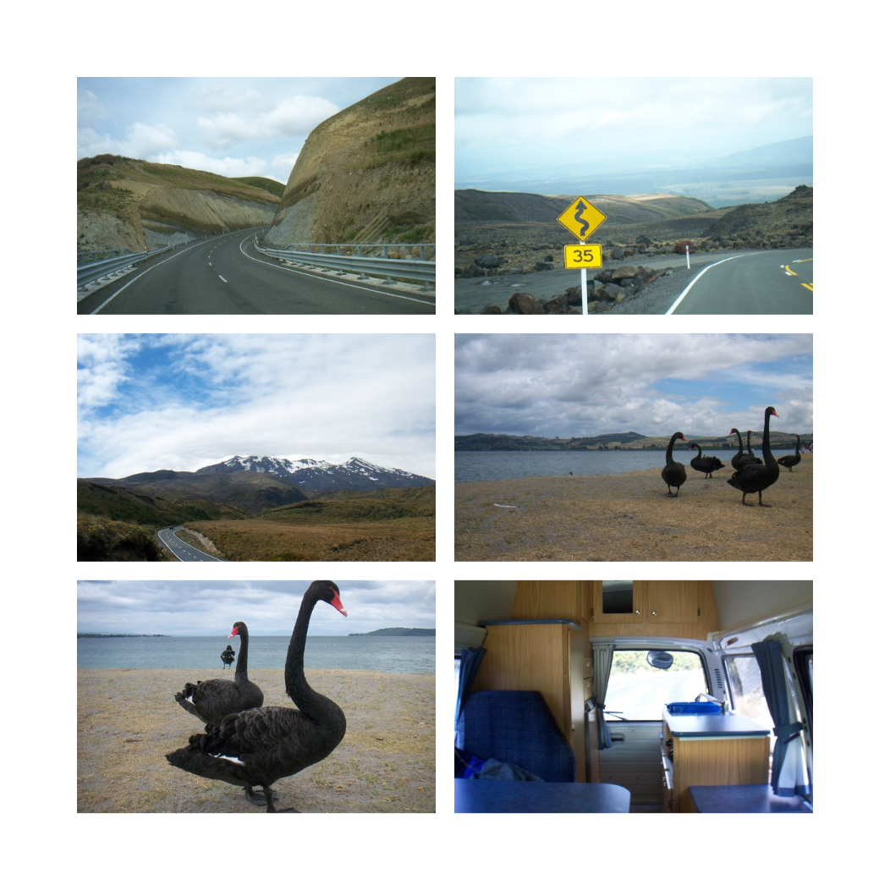
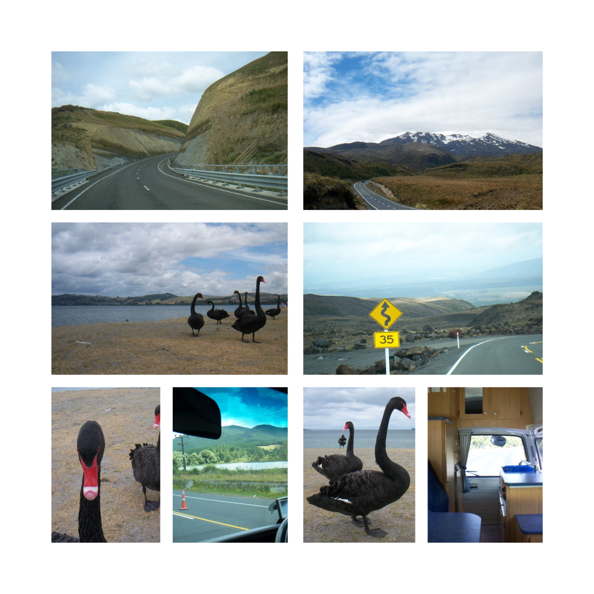

# Photobook Page Maker
Creates professional styled photobook pages based on templates. Just put your images into the input folder, and run the script to create some layouts to choose between. 

Example output:

 
---
 

## Install
* Copy to a folder, such as /home/bin/photobook_maker
* Make sure that makepage.rb has execute permission (`chmod +x makepage.rb`)
* Have inkscape and ruby-dev installed

## How to use
### Easiest way
1. Place the input images for a page into the "input-photos" folder.
2. Click on makepage.rb

### Using separate input folders for pages (at the command line)
1. Copy your photos for the page into it's own folder, such as "page1images"
2. Run (from the same directory as the project):
`ruby makepage.rb page1images`

## What it produces
The `pages/` directory has all the pages produced by the script.

It randomly orders the input images, and inserts them into all of the templates, and generates .png copies so that the templates can be easily reviewed.

Whichever one you like the best you can edit further in inkscape via the SVG file, and delete the others.

You can rerun the script to produce the pages with the images in a different random order.